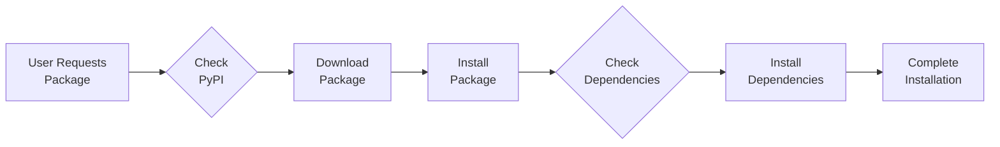

# Understanding Pip: Python’s Package Manager

Hello Python enthusiasts! Let’s get technical and break down what pip is, how it works, and its role in your development environment.

## What is Pip?

Pip (which stands for **Pip Installs Packages** or **Pip Installs Python**) is a command-line tool that simplifies the process of installing and managing Python libraries and packages. It interacts with the Python Package Index (PyPI) and other repositories to provide a seamless experience for managing dependencies in your projects.

> **Python Package Index (PyPI):** <a href="https://pypi.org/">PyPI</a> is the primary repository for Python packages. It hosts a vast collection of libraries and tools that you can integrate into your Python projects.
{: .prompt-info}

## How Does Pip Work?

Pip operates by leveraging a few core mechanisms to streamline package management:

- **Package Repositories:**
    Pip queries PyPI for packages. PyPI is a comprehensive index of Python libraries and tools, providing developers with access to a wide array of resources.
- **Installation Process:**
    When you execute a command like pip install requests, pip downloads the requests package and its dependencies from PyPI. It installs these packages into your Python environment, ensuring that all necessary components are available for your project.
- **Version Management:**
    Pip allows for precise control over package versions. You can specify exact versions or version ranges to ensure compatibility with your project requirements. 
    > `pip install numpy==1.21.0` 
    {: .prompt-tip}

## Virtual Environments:
Pip integrates seamlessly with Python’s virtual environments, created using tools like venv or virtualenv. Virtual environments allow you to isolate project dependencies, preventing conflicts between packages used in different projects. You can activate a virtual environment and use pip within that isolated space to manage project-specific packages.

## Upgrading and Uninstalling: 

- Pip simplifies the process of upgrading packages to their latest versions with:`pip install --upgrade package_name`
- To remove a package, you can use: `pip uninstall package_name`

## Requirements Files:

- A requirements.txt file lists all the packages required for a project. You can generate this file using: `pip freeze > requirements.txt`
- To install all packages specified in the requirements.txt file, use: `pip install -r requirements.txt`

## Common Pip Commands

Here are some essential pip commands to streamline your workflow:
- Install a Package: `pip install package_name`
- Upgrade a Package: `pip install --upgrade package_name`
- Uninstall a Package: `pip uninstall package_name`
- List Installed Packages: `pip list`
- Show Package Details: `pip show package_name`

## Visualizing Pip’s Workflow

To better understand how pip operates, let’s visualize the process using a flowchart:

In this flowchart:
- $$A$$ represents the user requesting a package.
- $$B$$ shows pip checking PyPI for the requested package.
- $$C$$ indicates downloading the package.
- $$D$$ involves installing the package.
- $$E$$ checks for any dependencies required by the package.
- $$F$$ installs those dependencies.
- $$G$$ marks the completion of the installation.

## Additional Resources

- **Pip Documentation:** Pip Docs provides comprehensive information about using pip, including advanced features and troubleshooting tips.
- **Virtualenv Documentation:** Virtualenv offers details on creating and managing isolated Python environments.
- **PyPI:** Python Package Index is where you can search for and download Python packages.

## Conclusion

Pip is a powerful tool that plays a pivotal role in modern Python development. It simplifies the process of managing libraries and dependencies, ensuring that your projects have access to the tools they need. By leveraging pip and virtual environments, you can maintain clean, organized, and efficient development workflows. If you want to package your own packages you can visit <a href="https://packaging.python.org/en/latest/tutorials/packaging-projects/">this link</a> or you want to know more technical details about installing packages you can visit <a href="https://packaging.python.org/en/latest/tutorials/installing-packages/">this link</a>!

Understanding and effectively using pip is essential for any Python developer. With its ability to manage package installations, upgrades, and removals, pip streamlines the development process, allowing you to focus more on coding and less on configuration. Happy coding, and may your Python projects be as smooth as your pip commands! 🚀🐍