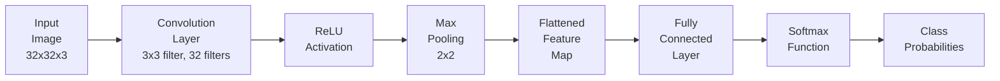
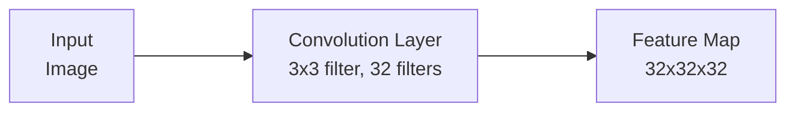

Convolutional Neural Networks (CNNs) have become a cornerstone of deep learning, particularly in the field of computer vision. From image recognition to object detection, CNNs have transformed the way machines interpret visual data.


In this blog post, we’ll delve into the architecture of CNNs, explore their advantages and disadvantages, and provide a detailed implementation in PyTorch. 

Convolutional Neural Networks (CNNs) consist of several key layers that work together to process and analyze grid-like data such as images. Below is a detailed explanation of each layer in a typical CNN architecture, including mathematical formulas and a Mermaid graph to visualize the architecture.

## 1. Convolution Layer



The convolutional layer is where the magic happens. It applies a set of filters (kernels) to the input image to produce feature maps. Each filter detects different features like edges, textures, or patterns.


**Kernel(Filter):** A kernel (or filter) is a small matrix used to scan the input image and produce feature maps. It is the core of the convolution operation. Kernels are used to detect various features such as edges, textures, and patterns in the input data. Different kernels can detect different features. The kernel size refers to the dimensions of the kernel matrix. Common sizes include 3x3, 5x5, and 7x7.The kernel size determines how much of the input image is covered at a time during the convolution operation.

$$\begin{bmatrix} 1 & 0 & -1 \\1 & 0 & -1\\1 & 0 & -1 \\\end{bmatrix}_{3x3}\quad$$

<p style='text-align:center;'><i>Example: 3x3 Vertical Edges Detection Kernel</i></p>

**Stride:** The stride is the number of pixels by which the kernel moves across the input image. It determines how much the kernel shifts after each operation. Stride controls the spatial dimensions of the output feature map. A larger stride results in a smaller output feature map.
- Stride of 1: The kernel moves 1 pixel at a time.
- Stride of 2: The kernel moves 2 pixels at a time, effectively downsampling the feature map.

**Padding:** Padding refers to the addition of extra pixels around the border of the input image. Padding is often used to control the spatial dimensions of the output feature map. Padding helps in maintaining the size of the feature map or adjusting it according to requirements. It also ensures that the edge information of the input image is preserved.
Types:

- Valid Padding: No padding is applied, which reduces the feature map size.
- Same Padding: Padding is added to ensure the output feature map size is the same as the input size.


_Example of padding with a value of 0 and a size of (2x2)_


$$ (W_{out}​,H_{out}​) = (\dfrac{W_{in}​ − K + 2P}{S}​+1,\dfrac{H_{in}​ − K + 2P}{S} ​+1 )$$ 


Where:
- $$W_{out}​, H_{out}​:$$ Output width and height
- $$W_{in}​, H_{in}​:$$ Input width and height
- $$K:$$ Kernel size
- $$P:$$ Padding
- $$S:$$ Stride
  


_Example of a convolution operation with a stride value of 1_


**Convolution Operation**: The convolution operation involves sliding the kernel over the input image and computing the dot product between the kernel and the portion of the image it covers.This operation transforms the input image into feature maps, which represent various features extracted from the input.

$$Feature\ Map(i,j)=\sum_{m=0}^{K−1}\sum_{n=0}^{K−1}Input(i+m,j+n)⋅Kernel(m,n)$$

**To further explain the concept of image input:** Each image has specific pixel values, which are numerical values within a matrix. These pixels form the various elements of the image. Colored images are composed of three channels: Red (R), Green (G), and Blue (B), commonly referred to as RGB. In cases where there are three channels, the convolution operation is carried out as shown in the example below.


_Three Channel Convolutional Operation with 1 Stride_

## 2. Pooling Layer


_Pooling Types_ 

Pooling is a down-sampling operation that reduces the spatial dimensions of the feature maps while preserving important features. Pooling helps reduce the computational load and provides spatial invariance by summarizing the features. There are two types:
- Max Pooling: Takes the maximum value from each patch of the feature map.
- Average Pooling: Takes the average value from each patch of the feature map.

Pooling is typically used with the padding value set to "same," while the default value is "valid."

**Padding Value Calculation:** $$ (f-1) / 2 $$ <br>
**Output Size Calculation:** $$\left\lfloor \frac{n + 2p - f}{s} \right\rfloor + 1$$ 

- $$n:$$ input size <br>
- $$p:$$ padding <br>
- $$f:$$ filter (kernel) size <br>
- $$s:$$ stride value <br>

## 3. Normalization Layer

This process compresses the distribution of data to enhance its readability. Typically, normalization in an RGB image involves dividing by 255 since there are 256 pixel values.

## 4. Fully-Connected Layer

Flattens the pooled feature maps and connects every neuron to every neuron in the next layer. This layer is responsible for classifying the extracted features.
Converts 2D feature maps into a 1D vector and applies a linear transformation.


## Pros and Cons

<table>
<tr>
<th>Advantages</th>
<th>Disadvantages</th>
</tr>
<tr>
<td ><b>Automatic Feature Extraction:</b><br> 
Learns features directly from data without 
manual feature engineering.</td>
<td><b>Computationally Intensive:</b><br>Requires significant
 computational resources, especially for large models and datasets.</td>
</tr>
<tr>
<td><b>Translation Invariance:</b><br>Can recognize features regardless of 
their position in the input image.</td>
<td><b>Overfitting:</b><br> Risk of overfitting with limited data, requiring regularization techniques.</td>
</tr>
<tr>
<td><b>Scalability:</b><br>Effective for various tasks and scales well with 
larger datasets.</td>
<td><b>Complexity:</b><br>Design and tuning of architecture can be complex and require domain expertise.</td>
</tr>
<tr>
<td><b>Hierarchical Feature Learning:</b><br>Learns different levels of features from edges to complex objects.</td>
<td><b>Data Hungry:</b><br>Requires large amounts of labeled data to achieve high performance.</td>
</tr>
</table>


## Conclusion

CNNs leverage convolutional layers, activation functions, pooling, and fully connected layers to process and classify image data effectively. Their architecture allows them to detect and learn spatial hierarchies of features, making them powerful for tasks like image recognition.


## Codes 

```python
import torch
import torch.nn as nn
import torch.optim as optim
import torch.nn.functional as F
from torchvision import datasets, transforms
from torch.utils.data import DataLoader
# Define the CNN model
class CNN(nn.Module):
    def __init__(self):
        super(CNN, self).__init__()
        self.conv1 = nn.Conv2d(1, 32, kernel_size=3, padding=1)  # Convolutional Layer 1
        self.conv2 = nn.Conv2d(32, 64, kernel_size=3, padding=1) # Convolutional Layer 2
        self.fc1 = nn.Linear(64 * 7 * 7, 128) # Fully Connected Layer 1
        self.fc2 = nn.Linear(128, 10) # Output Layer

    def forward(self, x):
        x = F.relu(F.max_pool2d(self.conv1(x), 2)) # Convolutional + ReLU + Pooling
        x = F.relu(F.max_pool2d(self.conv2(x), 2)) # Convolutional + ReLU + Pooling
        x = x.view(-1, 64 * 7 * 7) # Flatten
        x = F.relu(self.fc1(x)) # Fully Connected + ReLU
        x = self.fc2(x) # Output Layer
        return F.log_softmax(x, dim=1) # Softmax for classification

# Hyperparameters and data preparation
device = torch.device("cuda" if torch.cuda.is_available() else "cpu")
transform = transforms.Compose([transforms.ToTensor(), transforms.Normalize((0.1307,), (0.3081,))])
train_loader = DataLoader(datasets.MNIST('./data', train=True, download=True, transform=transform), batch_size=64, shuffle=True)
test_loader = DataLoader(datasets.MNIST('./data', train=False, download=True, transform=transform), batch_size=1000, shuffle=False)

model = CNN().to(device)
optimizer = optim.Adam(model.parameters(), lr=0.001)

# Training function
def train(model, device, train_loader, optimizer, epoch):
    print("train started")
    model.train()
    for batch_idx, (data, target) in enumerate(train_loader):
        data, target = data.to(device), target.to(device)
        optimizer.zero_grad()
        output = model(data)
        loss = F.nll_loss(output, target)
        loss.backward()
        optimizer.step()
        if batch_idx % 100 == 0:
            print(f'Train Epoch: {epoch} [{batch_idx * len(data)}/{len(train_loader.dataset)}] Loss: {loss.item():.6f}')

# Testing and evaluating function
def test(model, device, test_loader):
    print("test started")
    model.eval()
    test_loss = 0
    correct = 0
    with torch.no_grad():
        for data, target in test_loader:
            data, target = data.to(device), target.to(device)
            output = model(data)
            test_loss += F.nll_loss(output, target, reduction='sum').item()
            pred = output.argmax(dim=1, keepdim=True)
            correct += pred.eq(target.view_as(pred)).sum().item()
    test_loss /= len(test_loader.dataset)
    accuracy = 100. * correct / len(test_loader.dataset)
    print(f'Test set: Average loss: {test_loss:.4f}, Accuracy: {correct}/{len(test_loader.dataset)} ({accuracy:.2f}%)')
    return accuracy

# Training and evaluating the model
for epoch in range(1, 5):
    print(epoch,". epoch started")
    train(model, device, train_loader, optimizer, epoch)
accuracy = test(model, device, test_loader)
```
> Test set: Average loss: 0.0288, Accuracy: 9901/10000 (99.01%)

