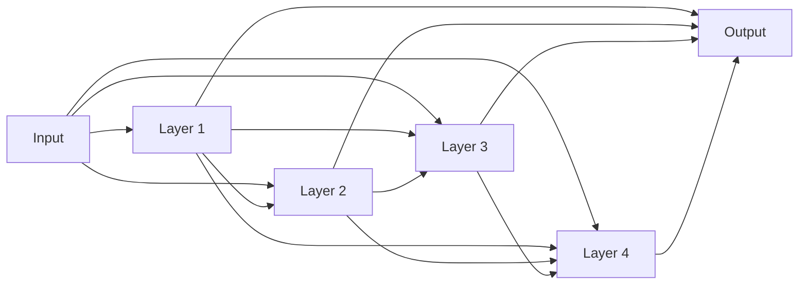
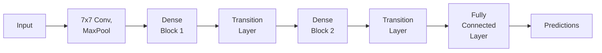

## Introduction

In deep learning, architectures are becoming increasingly deep and complex. While depth contributes to stronger feature extraction, it also introduces problems such as vanishing gradients and redundant feature learning. DenseNet, introduced by **_Gao Huang et al. in 2017_**, offers an elegant solution to these issues by introducing dense connections between layers.

DenseNet improves feature propagation, encourages feature reuse, and offers a more efficient parameter structure compared to traditional Convolutional Neural Networks (CNNs). In this blog post, we’ll explore DenseNet's architecture, advantages, potential drawbacks, and implement it in PyTorch — both using pre-built version. 

## DenseNet Architecture Overview


DenseNet introduces the concept of dense blocks, where each layer$$(L)$$ is connected to every other layer within the same block. Instead of just passing information from one layer to the next, DenseNet concatenates the outputs of all previous layers as inputs to subsequent layers.

## DenseNet Block Connectivity

DenseNet connectivity can be mathematically represented as follows:

$$ x_l = H_l([x_0,x_1,…,x_{l−1}]) $$

Where:

- $$H_l$$​ represents the operations of batch normalization, ReLU activation, and convolution.
- $$[x_0,x_1,…,x_{l−1}]$$ indicates the concatenation of feature maps from all previous layers.

For a network with L layers, the number of direct connections is 
$$
\frac{L \times (L + 1)}{2}
$$ 


There are various DenseNet architectures, each designed to reduce the number of parameters compared to other models, with ongoing efforts to minimize this further.To achieve this reduction, DenseNet architectures limit the number of inputs at each layer to a specific value (e.g., k=12). This k value represents the number of inputs, unlike traditional architectures where the number of inputs is not constrained. After limiting the inputs, these features are added to a feature map, and the architecture is completed with an average pooling layer and a softmax layer.

This concatenation allows the model to reuse features learned by preceding layers, which enables DenseNet to extract richer feature representations with fewer parameters.

## Network Visualization

To understand how dense connections work within a block, let’s visualize the data flow using a Mermaid diagram.



In the diagram above, every layer in the block receives input from all preceding layers and concatenates their feature maps. This dense connectivity pattern encourages feature reuse.
DenseNet Layers: Transition Layers

After a dense block, a transition layer is typically used to reduce the size of the feature maps and the number of channels. The transition layer applies a 1x1 convolution followed by 2x2 average pooling to halve the spatial dimensions. **The transition layer can be expressed as:**

$$x_{out} = AvgPool(W_{conv} \ ∗∗\ x_{in})$$

Where $$W_{conv}$$​ represents the 1x1 convolution filter, and **∗∗** denotes the convolution operation.

## DenseNet Architecture

A typical DenseNet model consists of:

- Initial Convolutional Layer: This layer is usually a 7x7 convolution followed by max-pooling.
- Dense Blocks: Dense blocks where each layer receives input from all preceding layers. The number of layers per block is determined by a hyperparameter.
- Transition Layers: Located between dense blocks to down-sample feature maps using convolution and pooling operations.
- Classification Layer: A fully connected layer for classification at the end of the network.

The following image visualizes a simple DenseNet architecture with 2 dense blocks.



## DenseNet Variants


_DenseNet Types_

  - DenseNet-B (Bottleneck Architecture): The goal here is to reduce model complexity using 1x1 matrices and convolutional/pooling structures.

  - DenseNet-C (Compactness Architecture): This variant aims to improve model efficiency by reducing the number of feature maps in transition layers. A specific compression factor is determined, and structures below this compression value are classified as DenseNet-C. 
  - DenseNet-BC: When both bottleneck layers and transition layers with θ<1 are used, the architecture is referred to as DenseNet-BC.


## Pros and Cons of DenseNet
### Pros

- **Efficient Parameter Usage:** DenseNet significantly reduces the number of parameters compared to traditional deep architectures like ResNet.
- **Feature Reuse:** DenseNet encourages feature reuse, which leads to more compact and robust feature representations.
- **Improved Gradient Flow:** Dense connections help mitigate the vanishing gradient problem, resulting in more stable and effective training.
- **Less Overfitting:** DenseNet tends to generalize better on smaller datasets due to the strong regularization effect of feature reuse.

### Cons
- **Memory Usage:** Dense connections result in a high memory overhead because of the concatenation of feature maps.
- **Training Time:** Due to the increased number of connections, DenseNet requires more computation per forward pass, leading to longer training times.
- **Diminishing Returns:** Increasing the depth of DenseNet does not always yield significant improvements and may lead to redundant computations.


## Conclusion

Last but not least, DenseNet presents a creative and effective way of addressing the challenges of deep learning architectures, such as vanishing gradients and feature redundancy. By densely connecting layers, DenseNet promotes feature reuse and optimizes network capacity, resulting in a highly efficient model.

We explored both a pre-trained and a custom implementation of DenseNet in PyTorch, complete with a training and evaluation pipeline. Whether you're working on image classification tasks or exploring dense architectures for more complex problems, DenseNet is a powerful tool to add to your deep learning toolkit.

## Codes 
### DenseNet (Pre-trained) in PyTorch
Let’s now implement DenseNet using PyTorch. We’ll start by using a pre-trained DenseNet model, followed by building our own from scratch.
**Pre-trained DenseNet Using** `torchvision`

```python
import torch
import torch.nn as nn
import torchvision.models as models
import torch.optim as optim
import torchvision.transforms as transforms
import torchvision.datasets as datasets

# Load pre-trained DenseNet121 model
model = models.densenet121(weights='DEFAULT') # use pretrained = True for  version below 0.13
print(model)

# Modify the classifier to fit your dataset's number of classes
num_ftrs = model.classifier.in_features
model.classifier = nn.Linear(num_ftrs, 10)  # CIFAR10 has possible 10 classes for an example

# Prepare for training
criterion = nn.CrossEntropyLoss()
optimizer = optim.Adam(model.parameters(), lr=0.001)

# Data augmentation and normalization for training
transform = transforms.Compose([
    transforms.Resize(224),  # Resize images to match the DenseNet input size
    transforms.ToTensor(),
    transforms.Normalize((0.5, 0.5, 0.5), (0.5, 0.5, 0.5))
])

# Load dataset
train_dataset = datasets.CIFAR10(root='./data', train=True, download=True, transform=transform)
train_loader = torch.utils.data.DataLoader(train_dataset, batch_size=32, shuffle=True)


# Training loop
device = torch.device("cuda" if torch.cuda.is_available() else "cpu")
model.to(device)

for epoch in range(10):  # Loop over the dataset multiple times
    running_loss = 0.0
    for inputs, labels in train_loader:
        inputs, labels = inputs.to(device), labels.to(device)
        
        # Zero the parameter gradients
        optimizer.zero_grad()

        # Forward + backward + optimize
        outputs = model(inputs)
        loss = criterion(outputs, labels)
        loss.backward()
        optimizer.step()

        # Print statistics
        running_loss += loss.item()
    print(f'Epoch {epoch+1}, Loss: {running_loss/len(train_loader):.4f}')


# Evaluate on test set
test_dataset = datasets.CIFAR10(root='./data', train=False, download=True, transform=transform)
test_loader = torch.utils.data.DataLoader(test_dataset, batch_size=32, shuffle=False)

model.eval()
correct = 0
total = 0
with torch.no_grad():
    for inputs, labels in test_loader:
        inputs, labels = inputs.to(device), labels.to(device)
        outputs = model(inputs)
        _, predicted = torch.max(outputs.data, 1)
        total += labels.size(0)
        correct += (predicted == labels).sum().item()

print(f'Test Accuracy: {100 * correct / total:.2f}%')
```

> This code loads a pre-trained DenseNet121 model from torchvision and modifies the classifier to fit a custom dataset with 10 classes. We then perform training using the CIFAR-10 datasets. I trained this model just 1 epoch instead of 10 and then test on train and test datasets; Results are that train Accuracy is  86.82% and Test Accuracy is 84.84%.

### Custom DenseNet Implementation from Scratch 

```python 
import torch
import torch.nn as nn

class DenseLayer(nn.Module):
    def __init__(self, in_channels, growth_rate):
        super(DenseLayer, self).__init__()
        self.bn = nn.BatchNorm2d(in_channels)
        self.relu = nn.ReLU(inplace=True)
        self.conv = nn.Conv2d(in_channels, growth_rate, kernel_size=3, padding=1, bias=False)
    
    def forward(self, x):
        out = self.bn(x)
        out = self.relu(out)
        out = self.conv(out)
        return out

class DenseBlock(nn.Module):
    def __init__(self, in_channels, growth_rate, n_layers):
        super(DenseBlock, self).__init__()
        self.layers = nn.ModuleList()
        for _ in range(n_layers):
            self.layers.append(DenseLayer(in_channels, growth_rate))
            in_channels += growth_rate
    
    def forward(self, x):
        for layer in self.layers:
            new_features = layer(x)
            x = torch.cat([x, new_features], 1)
        return x
        
class TransitionLayer(nn.Module):
    def __init__(self, in_channels, out_channels):
        super(TransitionLayer, self).__init__()
        self.bn = nn.BatchNorm2d(in_channels)
        self.relu = nn.ReLU(inplace=True)
        self.conv = nn.Conv2d(in_channels, out_channels, kernel_size=1, bias=False)
        self.pool = nn.AvgPool2d(kernel_size=2, stride=2)
    
    def forward(self, x):
        x = self.bn(x)
        x = self.relu(x)
        x = self.conv(x)
        x = self.pool(x)
        return x
        
class DenseNet121(nn.Module):
    def __init__(self, growth_rate=32, block_layers=[6, 12, 24, 16], num_classes=10):
        super(DenseNet121, self).__init__()
        
        # Initial Convolution Layer
        self.conv1 = nn.Conv2d(3, 64, kernel_size=7, stride=2, padding=3, bias=False)
        self.bn1 = nn.BatchNorm2d(64)
        self.relu = nn.ReLU(inplace=True)
        self.pool = nn.MaxPool2d(kernel_size=3, stride=2, padding=1)
        
        # Dense Blocks and Transition Layers
        self.dense_blocks = nn.ModuleList()
        self.transition_layers = nn.ModuleList()
        
        in_channels = 64
        for i, num_layers in enumerate(block_layers):
            block = DenseBlock(in_channels, growth_rate, num_layers)
            self.dense_blocks.append(block)
            in_channels += num_layers * growth_rate
            if i < len(block_layers) - 1:
                transition = TransitionLayer(in_channels, in_channels // 2)
                self.transition_layers.append(transition)
                in_channels = in_channels // 2
        
        # Final Classification Layer
        self.global_avg_pool = nn.AdaptiveAvgPool2d((1, 1))
        self.fc = nn.Linear(in_channels, num_classes)
    
    def forward(self, x):
        x = self.conv1(x)
        x = self.bn1(x)
        x = self.relu(x)
        x = self.pool(x)
        
        for block, transition in zip(self.dense_blocks, self.transition_layers):
            x = block(x)
            x = transition(x)
        
        x = self.dense_blocks[-1](x)
        x = self.global_avg_pool(x)
        x = torch.flatten(x, 1)
        x = self.fc(x)
        return x

model = DenseNet121(num_classes=10) # for cifar 10 classes
print(model)
```

> This code create a Custom DenseNet121 model. We then perform training using the CIFAR-10 datasets. I trained this model just 1 epoch instead of 10 and then test on train and test datasets; Results are that train Accuracy is  54.76% and Test Accuracy is 44.83%.
