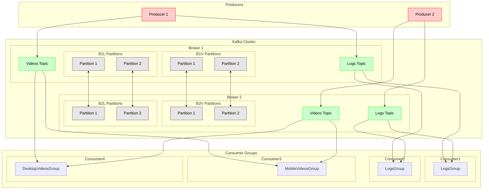

## Introduction
Apache Kafka has become one of the most powerful tools for distributed streaming and messaging in large-scale data ecosystems. Whether you're working with real-time data processing, event-driven architectures, or data pipelines, **Kafka offers a reliable, scalable, and fault-tolerant platform** that integrates seamlessly into modern architectures.

Kafka was originally developed by LinkedIn, later open-sourced in 2011, and is now maintained by the Apache Software Foundation. **Kafka is designed to handle vast amounts of data and distribute it across multiple systems efficiently**, making it a key player in big data environments.

### **What’s New with Kafka**

Kafka continues to evolve with every release. **Key recent improvements** include:

- **Kafka Raft Consensus (KRaft)**: Kafka has introduced a Zookeeper-free mode, aiming to replace Zookeeper with an internal Raft protocol. This simplifies Kafka’s architecture and operational complexity.
- **Improved Consumer Rebalancing**: Kafka has made significant progress in improving consumer rebalancing efficiency, reducing downtime during rebalance events.
- **Tiered Storage**: Kafka now supports tiered storage for longer retention periods at reduced costs.
- **Kafka Streams**: The Kafka Streams API is becoming more powerful, offering new ways to process streams directly within Kafka without external tools.

<hr>
Let's assume we need a system collect logs and videos share/watch. If we want to build this with Apache kafka, we can draw a simple diagram like below.




> The system is designed to efficiently handle both logs and videos using Apache Kafka. Producers within the system collect various types of logs, including system logs, database logs, and crash reports, along with videos from desktop and mobile sources. This data is then sent to brokers within a Kafka cluster.
In the Kafka cluster, logs and videos are organized into specific topics, which are further divided into partitions. These partitions help distribute the data across multiple brokers, ensuring the system is scalable and resilient to failures.Different consumer groups process the data once it is stored in Kafka. Logs are consumed by a group of consumers that share the same group ID, allowing consistent analysis across all log data. On the other hand, videos are consumed by separate consumer groups, each with a different group ID, ensuring that video streams are processed independently.This system allows for efficient processing of both logs and videos, ensuring data is managed and consumed effectively based on its type.
{: .prompt-info}

## **Architecture Overview**

At its core, Kafka is a **publish-subscribe messaging system (pub/sub)** where **Producers** send messages to **Brokers** with **topics**, and **Consumers** retrieve those messages from **Topics**.

> If we want to kafka act like pub-sub, we should set **group-ids different for same topic**. Otherwise we want to kafka work like queue we should set **group-ids same for same topic**. 
{: .prompt-tip}

> In pub-sub format the message is published only once and consumed many times, whereas in queue format the message is published only once and consumed only once, after which the message is removed from the queue.
{: .prompt-info}

Kafka is composed of the following core components:

1. **Producer**: Producers are clients that send data to Kafka. They push records (messages) to a specific topic within the Kafka cluster.
2. **Consumer**: Consumers read data from Kafka topics. They can subscribe to one or more topics and process incoming messages as needed.
3. **Broker**: A Kafka broker is a server that manages message storage and serves clients (producers and consumers). Brokers form a Kafka **cluster**, and data is distributed across them for load balancing and fault tolerance.
4. **Topic**: Topics are the main abstraction in Kafka. They represent a logical channel to which producers send messages, and consumers subscribe to them. **Topics are partitioned, replicated across multiple brokers and each partition is an ordered sequence of records.**
5. **Partition**: Each topic can be divided into multiple partitions **to distribute load**, **enabling parallel processing and scalability .**
6. **Replication**: To ensure **fault tolerance**, Kafka replicates partitions across multiple brokers. **Replication ensures data durability even in the event of broker failure.**
7. **Offsets**: A unique identifier assigned to each message within a partition. Consumers use offsets to track which messages have been processed.
8. **Zookeeper/KRaft:** Originally, Zookeeper was used for cluster coordination, but now **KRaft** mode is being adopted for better scalability and operational simplicity. (I will write another blog post about them.)
9. **Cluster**: A group of brokers working together. Data is distributed across brokers to ensure **high availability and load balancing.**

Kafka's **log-based architecture** ensures **sequential writes** to disk, **minimizing overhead and providing low-latency throughput.**

## **Pipeline Working**
1. **Producer sends data (message/event)**:
    - A **producer** is an application or service that creates messages and sends them to Kafka. The producer sends data to a **Kafka topic**.
    - **Partitioning**: If the topic has multiple partitions, the producer decides which partition the message will go to. This can be based on the message's key (deterministic partitioning) or a round-robin approach.
    - The producer sends messages to one or more Kafka brokers, which handle the topic’s partitions.
2. **Data arrives at the Broker**:
    - The **broker** receives the message from the producer and stores it in the appropriate **partition** within the **topic**. Kafka brokers are responsible for persisting the messages and managing the offsets.
    - Each partition acts as an ordered, immutable sequence of records that the broker maintains.
3. **Replication**:
    - Kafka supports **replication** for fault tolerance. The broker replicates data to other brokers based on the topic's **replication factor**.
    - The leader of a partition replicates the data to its followers (replica brokers). If the leader fails, a follower takes over as the leader to ensure no data loss.
4. **Offsets management**:
    - Kafka maintains an **offset** for every message within a partition. This offset is a unique identifier that determines the position of the message within the partition. It acts as an index for tracking the position of the messages.
    - Each consumer in a **consumer group** tracks its own **offset** to know which message to read next. Offsets are committed by consumers to Kafka either automatically or manually, depending on the consumer's configuration.
5. **Consumer group reads data**:
    - A **consumer** (or a group of consumers) subscribes to one or more topics and starts pulling data from Kafka brokers.
    - **Consumer groups** allow horizontal scaling, where each consumer in the group is assigned to read from a specific partition. This ensures that messages are processed in parallel but never by more than one consumer in a group.
    - Consumers can read messages sequentially from the assigned partition, starting from the offset where they last left off.
6. **Error Handling and Fault Tolerance**:
    - Kafka ensures **fault tolerance** through **replication**. If a broker crashes, the leader partition is automatically elected from the available replicas.
    - Kafka also allows consumers to **re-read messages** by resetting their offsets. This is useful for error recovery and reprocessing.
7. **Acknowledgments**:
    - When the message is successfully stored on the broker, Kafka sends an acknowledgment to the producer.
    - The producer can be configured to wait for acknowledgment from **all** replicas (strong durability) or just the leader (higher throughput but less durability).
8. **Consumers process and commit offsets**:
    - Once a consumer reads and processes the message, it can **commit** the offset to Kafka to record that the message has been processed. The next time the consumer reads from the partition, it will start at the next offset.
    - Committing offsets ensures that if a consumer crashes and restarts, it won’t reprocess already consumed messages.

### **Kafka Pipeline Diagram**

```mermaid
graph TB
    classDef producerStyle color:black,fill:#e0f7fa,stroke:#006064,stroke-width:2px;
    classDef brokerStyle color:black,fill:#fff9c4,stroke:#fbc02d,stroke-width:2px;
    classDef consumerStyle color:black,fill:#c8e6c9,stroke:#388e3c,stroke-width:2px;
    classDef errorStyle color:black,fill:#f8bbd0,stroke:#c2185b,stroke-width:2px;

    %% nodes 
    A(("<b><u>Send Data</u></b>
    Producer sends 
    data to a Kafka topic")):::producerStyle 
    B[("<b><u>Partition & Store</u></b>
    Broker receives and 
    stores data in the 
    correct partition")]:::brokerStyle
    C[("<b><u>Replication</u></b>
    Cluster Data is 
    replicated to other
     brokers for fault tolerance")]:::brokerStyle
    D[("<b><u>Track Offset</u></b>
    Kafka assigns an
    offset to each 
    message in a partition")]:::brokerStyle
    E((("<b><u>Read Data</u></b>
    Consumers read 
    messages sequentially
    from the partitions
    they are assigned to
    "))):::consumerStyle
    F((("<b><u>Process Data</u></b>
    Consumers process
    the messages and
    commit the offsets
    back to Kafka"))):::consumerStyle
    G{"<b><u>Error Handling</u></b>
    In case of broker
     failure, replication 
     ensures no data
      loss or downtime
"}:::errorStyle
    
    %% directions 
    subgraph Producer
        direction LR
        A  
    end 
    subgraph Broker 
        direction LR
        A -.-> B
        B -.-> C
        C -.-> D
    end 
    subgraph Consumer/Consumer Group
        direction LR
        D -.-> E
        E -.-> F 
    end 
    subgraph Broker/Cluster
        F -.-> G 
    end

    linkStyle 0 stroke:#006064,stroke-width:2px,stroke-dasharray:5,5;
    linkStyle 1 stroke:#fbc02d,stroke-width:2px,stroke-dasharray:5,5;
    linkStyle 2 stroke:#fbc02d,stroke-width:2px,stroke-dasharray:5,5;
    linkStyle 3 stroke:#fbc02d,stroke-width:2px,stroke-dasharray:5,5;
    linkStyle 4 stroke:#388e3c,stroke-width:2px,stroke-dasharray:5,5;
    linkStyle 5 stroke:#c2185b,stroke-width:2px,stroke-dasharray:5,5;

```



<hr>


_Message order may guarantee only per partition, but not for all messages within all topic. Image by <a href="https://medium.com/geekculture/essential-kafka-overview-with-pictures-bffd84c7f6ac">Vladimir Topolev</a>_

### **Kafka Pipeline Example**
Here is an example to illustrate the **working order** in the Kafka pipeline:

1. Set up the Kafka environment using Docker with Zookeeper and multiple Kafka brokers
2. Create a Kafka topic named 'user-events' with 3 partitions and a replication factor of 3
3. Create 5 producers and send a total of 20 messages to the 'user-events' topic, distributing them randomly across partitions
4. Create a consumer group named 'consumer-group-1', read messages from the 'user-events' topic, process them, and print to the screen
5. Run the system by first creating the topic, then starting the producers to send messages, and finally starting the consumer to read messages

## Install Kafka & Python Usage

You can install kafka two ways, first you can install manually;<a href="https://kafka.apache.org/quickstart">download kafka, zookeeper and java open jdk</a>. Second way is you can install kafka with docker. In this post, i will use docker version because it is easier than manual version. 

### Kafka with Zookeeper


_Apache Kafka with Zookeeper. Image by <a href="https://medium.com/geekculture essential-kafka-overview-with-pictures-bffd84c7f6ac">Vladimir Topolev</a>_
First, you'll need a Docker setup to run Kafka with zookeeper. I installed kafka with zookeeper because KRaft configurations raise exception, and i did not figure out. In time i am planning to another blog post KRaft vs Zookeeper. 

Use the following `docker-compose.yml` file to install kafka with zookeeper:

```yaml
version: '3.7'

services:
  zookeeper:
    image: confluentinc/cp-zookeeper:latest
    environment:
      ZOOKEEPER_CLIENT_PORT: 2181
      ZOOKEEPER_SERVER_ID: 1
    ports:
      - "2181:2181"

  kafka-1:
    image: confluentinc/cp-kafka:latest
    ports:
      - "9092:9092"
      - "29092:29092"
    environment:
      KAFKA_ADVERTISED_LISTENERS: INTERNAL://kafka-1:19092,EXTERNAL://${DOCKER_HOST_IP:-127.0.0.1}:9092,DOCKER://host.docker.internal:29092
      KAFKA_LISTENER_SECURITY_PROTOCOL_MAP: INTERNAL:PLAINTEXT,EXTERNAL:PLAINTEXT,DOCKER:PLAINTEXT
      KAFKA_INTER_BROKER_LISTENER_NAME: INTERNAL
      KAFKA_ZOOKEEPER_CONNECT: "zookeeper:2181"
      KAFKA_BROKER_ID: 1
    depends_on:
      - zookeeper

  kafka-2:
    image: confluentinc/cp-kafka:latest
    ports:
      - "9093:9093"
      - "29093:29093"
    environment:
      KAFKA_ADVERTISED_LISTENERS: INTERNAL://kafka-2:19093,EXTERNAL://${DOCKER_HOST_IP:-127.0.0.1}:9093,DOCKER://host.docker.internal:29093
      KAFKA_LISTENER_SECURITY_PROTOCOL_MAP: INTERNAL:PLAINTEXT,EXTERNAL:PLAINTEXT,DOCKER:PLAINTEXT
      KAFKA_INTER_BROKER_LISTENER_NAME: INTERNAL
      KAFKA_ZOOKEEPER_CONNECT: "zookeeper:2181"
      KAFKA_BROKER_ID: 2
    depends_on:
      - zookeeper

  kafka-3:
    image: confluentinc/cp-kafka:latest
    ports:
      - "9094:9094"
      - "29094:29094"
    environment:
      KAFKA_ADVERTISED_LISTENERS: INTERNAL://kafka-3:19094,EXTERNAL://${DOCKER_HOST_IP:-127.0.0.1}:9094,DOCKER://host.docker.internal:29094
      KAFKA_LISTENER_SECURITY_PROTOCOL_MAP: INTERNAL:PLAINTEXT,EXTERNAL:PLAINTEXT,DOCKER:PLAINTEXT
      KAFKA_INTER_BROKER_LISTENER_NAME: INTERNAL
      KAFKA_ZOOKEEPER_CONNECT: "zookeeper:2181"
      KAFKA_BROKER_ID: 3
    depends_on:
      - zookeeper
```

### Kafka Package Install for Python 

The `kafka-python` package allows you to interact with Kafka in Python. Install the `kafka-python` package using pip:

```
pip install kafka-python
```

Here’s the Python code that demonstrates producing and consuming messages with Kafka using the `kafka-python` package:

First of all, we need to create topic or topics. Let’s assume same example above `user-events`. Let’s create `create_topics.py` file.

```python
from kafka.admin import KafkaAdminClient, NewTopic

def create_topic(topic_name,num_partitions,replication_factor):
    admin_client = KafkaAdminClient(
        bootstrap_servers=['localhost:9092','localhost:9093','localhost:9094'],
        client_id='test'
    )

    topic = NewTopic(
        name=topic_name,
        num_partitions=num_partitions,
        replication_factor=replication_factor
    )

    admin_client.create_topics(new_topics=[topic], validate_only=False)
    print(f"Topic '{topic_name}' created with {num_partitions} partitions and replication factor {replication_factor}")

if __name__ == "__main__":
    create_topic(topic_name = 'user-events',num_partitions = 3, replication_factor = 3)
```
> Replication factor must not be bigger than number of our kafka replicas. In this example max. is 3.
{: .prompt-warning}

Then we need to send some messages with producers. So let’s create `producer.py` file.

```python
from kafka import KafkaProducer
import time
import random

def produce_messages():
    bootstrap_servers = ['localhost:9092','localhost:9093','localhost:9094']
    topic = 'user-events'
    num_producers = 5
    num_messages = 20

    producers = [KafkaProducer(bootstrap_servers=bootstrap_servers) for _ in range(num_producers)]

    for i in range(num_messages):
        message = f"User Signed Up {i}".encode('utf-8')
        producer = random.choice(producers)
        partition = random.randint(0, 2)  # Randomly choose partition 0, 1, or 2
        producer.send(topic, value=message, partition=partition)
        print(f"Message sent to topic '{topic}' on partition {partition}")
        time.sleep(1)  # Simulate a delay between messages

    # Close all producers
    for producer in producers:
        producer.flush()
        producer.close()

if __name__ == "__main__":
    produce_messages()
```
> Partition must not be bigger than number of our kafka topic partition number. In this example max. is 3.
{: .prompt-warning}

Last but not least, we will create some consumers to read data from the topic are sended from producers. Let’s create `consumer1.py` and `consumer2.py` files.

```python
from kafka import KafkaConsumer
import time 

def consume_messages():
    bootstrap_servers = ['localhost:9092','localhost:9093','localhost:9094']
    topic = 'user-events'
    group_id = 'consumer-group-1'

    consumer = KafkaConsumer(
        topic,
        group_id=group_id,
        bootstrap_servers=bootstrap_servers,
        auto_offset_reset='earliest',
        enable_auto_commit=True,
        consumer_timeout_ms=1000
    )

    print(f"Consumer 1 started reading ")

    for message in consumer:
        print(f"Consumer 1 received message: {message.value.decode('utf-8')} read from partition {message.partition}")
           

if __name__ == "__main__":
    start = time.time()
    while True:
        consume_messages()
        passed_time = time.time() - start 
        if passed_time > 60:break 

```

Let’s create `consumer2.py` file:

```python
from kafka import KafkaConsumer
import time 

def consume_messages():
    bootstrap_servers = ['localhost:9092','localhost:9093','localhost:9094']
    topic = 'user-events'
    group_id = 'consumer-group-1'

    consumer = KafkaConsumer(
        topic,
        group_id=group_id,
        bootstrap_servers=bootstrap_servers,
        auto_offset_reset='earliest',
        enable_auto_commit=False,
        consumer_timeout_ms=1000
    )

    print(f"Consumer 2 started reading")

    for message in consumer:
        print(f"Consumer 2 received message: {message.value.decode('utf-8')} from partition {message.partition}")
        consumer.commit()

if __name__ == "__main__":
    start = time.time()
    while True:
        consume_messages()
        passed_time = time.time() - start 
        if passed_time > 60:break 
```

Finally, let’s open 5 bash terminal and test it. Type in terminals with order : 

```bash
> docker-compose up -d 
> python create_topics.py 
> python producer.py
> python consumer1.py  
> python consumer2.py 
```

> If you run `consumer1.py` and `consumer2.py` files at the same time, you can observe that some messages read from consumer1 and rest of messages read from consumer2. Because we set same group-id . I mean, it is queue formatted kafka example.
{: .prompt-tip}

>If you want to check topics etc. you can use codes below or look this <a href="https://kafka-python.readthedocs.io/en/master/usage.html">documentation</a>
{: .prompt-info}

```python
import kafka
servers=['localhost:9092','localhost:9093','localhost:9094']
admin_client = kafka.KafkaAdminClient(bootstrap_servers=servers)

admin_client.list_topics() # list all topics 
admin_client.describe_topics() # look details of topics 
admin_client.delete_topics(topics=['user-events']) # delete topics 
```

Kafka is widely used in scenarios like **ETL pipelines, event streaming, real-time analytics, log aggregation, and microservices communication**.

## Advantages and Disadvantages

### Advantages:

- **Scalability**: Kafka’s architecture allows you to easily scale producers, consumers, and brokers to handle growing workloads.
- **Fault Tolerance**: With **replication and partitioning**, Kafka can survive broker failures without data loss.
- **High Throughput**: Kafka is designed for **high-throughput use cases**, with low-latency data delivery.
- **Durability**: Kafka persists messages to disk, ensuring data reliability.
- **Flexibility**: Kafka supports **both streaming and batch processing**, making it adaptable to many use cases.

### Disadvantages:

- **Complex Setup**: Kafka clusters can be complex to deploy, configure, and manage, particularly for beginners.
- **Zookeeper Dependency**: Zookeeper can introduce operational complexity as it requires additional setup and management. `(it is solved with KRaft)`
- **Latency**: Kafka is not the best solution for extremely low-latency systems; while Kafka is **near real-time,** other systems may outperform it for ultra-low-latency needs.
- **Message Ordering**: Kafka guarantees order within a partition but not across the entire topic, which may require additional handling logic for certain applications.

## **Similar Technologies**

There are some similar technologies like RabbitMQ, Apache Flink, Apache, Pulsar or Apache Kinesis etc. 

| Technology | Comparison with Kafka |
| --- | --- |
| **RabbitMQ** | Lightweight, built for message queueing. |
| **Apache Pulsar** | Similar to Kafka but offers multi-tenancy and more flexible topic models. |
| **Amazon Kinesis** | Fully managed and integrated with AWS but lacks Kafka's flexibility. |
| **Apache Flink** | Focused on stateful computations, often paired with Kafka for stream processing. |

While **RabbitMQ** is suited for message queuing, Kafka excels at distributed data streaming. **Pulsar** is another contender with advantages like multi-tenancy, but Kafka’s extensive ecosystem and maturity make it a preferred choice for many enterprises.

## **Conclusion**

Apache Kafka is a **cornerstone technology in the world of real-time data streaming and event-driven architectures**. It enables companies to build robust, scalable, and fault-tolerant data pipelines, handling high-throughput and distributed processing requirements. Kafka’s **distributed architecture** makes it suitable for everything from logging and monitoring to **mission-critical enterprise applications**.

The **key advantages of Kafka**—scalability, durability, and high-throughput—make it ideal for **big data ecosystems** and **real-time analytics**. Its **replication and partitioning mechanisms** ensure **high availability** even under heavy load, while recent innovations like **KRaft mode** and **tiered storage** keep Kafka evolving for modern needs.

Kafka continues to stand out because of its **flexibility in integrating with stream processing platforms like Flink**, and it plays a vital role in microservices architectures and large-scale distributed systems. While Kafka has its challenges, the pros often outweigh the cons, especially for **high-traffic systems that need real-time processing**.

## References:

### Blog Posts 
- <a href="https://rohithsankepally.github.io/Kafka-Storage-Internals/">Kafka Storage Internals </a> by Rohith Sankepally. 
- <a href="https://medium.com/geekculture/essential-kafka-overview-with-pictures-bffd84c7f6ac">Kafka Overview with pictures </a> by Vladimir Topolev. 

### Videos
- <a href="https://www.youtube.com/watch?v=aj9CDZm0Glc"> What is Kafka? </a> by IBM Technology
- <a href="https://www.youtube.com/watch?v=Ch5VhJzaoaI"> Apache Kafka in 6 minutes</a> by James Cutajar
- <a href="https://www.youtube.com/watch?v=ZphPT3r6fnU&t=136s">  1 Videoda #Apache Kafka Nedir? Apache Kafka Neden Kullanılır? Apache Kafka Nasıl Kurulur? </a> by kablosuzkedi.